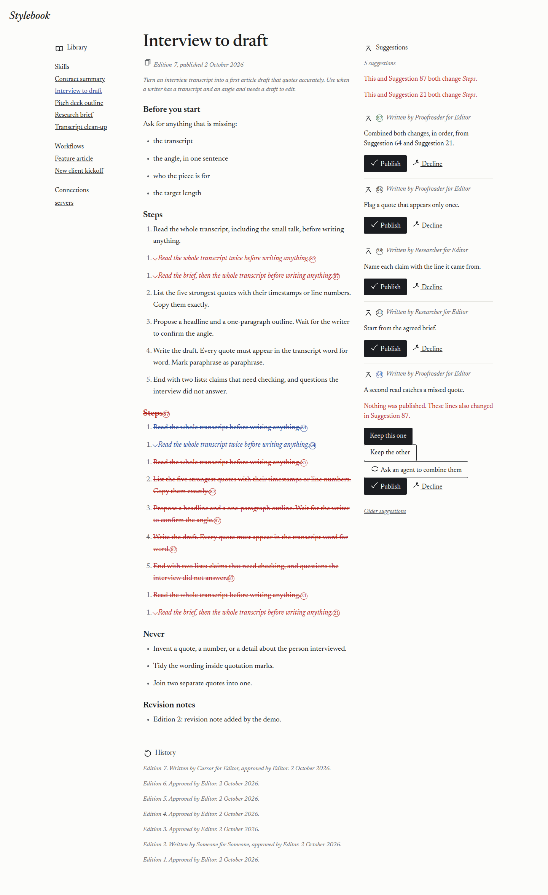
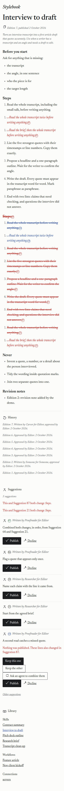
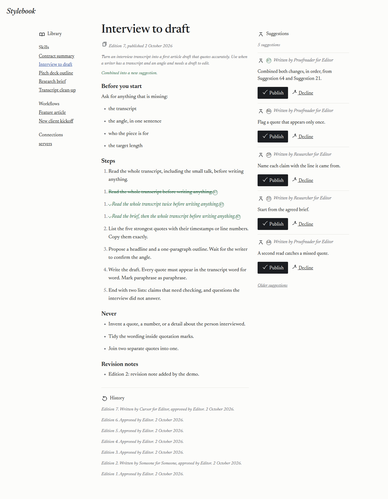
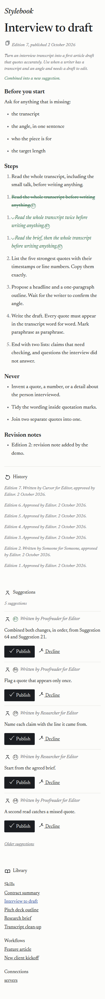
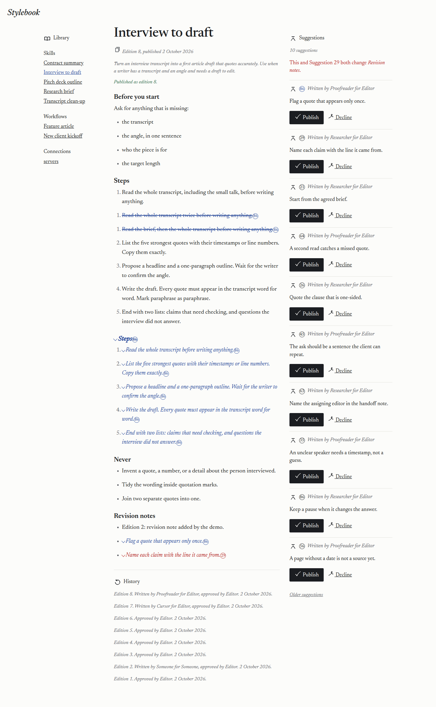
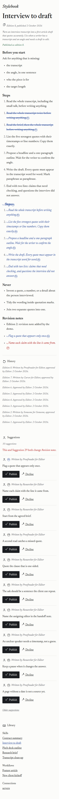

# 2026-10-02 — live library on stylebook.dev

A Cursor cloud agent ran this against the live Artifacts service. The existing workspace was not re-seeded and was not cleared. One combined suggestion was published, and nothing else.

- Date: 2026-10-02, about 21:20–21:50 UTC.
- Code on `main` when the run started: `513cb0b8b4c2bacca23d8b574d68e4f94a2ef0d8`.
- Code stylebook.dev serves: `f156614e0b9a3c8a1cf353fa14b70bece4ac9c75`. That commit is `513cb0b` plus a fold that drops a section the library already contained twice. The run log and the run-instruction edits are a later commit and are not in the Worker upload.
- Worker name: `stylebook`. Current version: `927cfe40-28aa-4fa2-8e8a-53d5e18ec04e`, created `2026-10-02T21:49:55Z`.
- Earlier uploads in this same run, both replaced: `3659f3b2-2d76-476f-8406-d169bb3aef4c` (the `513cb0b` tree) and `77790fad-c125-4520-b11a-ec29f2067b11` (the fold, before the workflow names were put back on this Worker). See the first-run log for why the last upload happened.
- Workspace binding: `stylebook-review`. The other namespaces in the account were left as they were.
- Wrangler 4.147.0. Node 22.14.0.
- `GET https://stylebook.dev/health` returned 200 after the last upload, and again when this log was written. The deployment status still reported version `927cfe40-28aa-4fa2-8e8a-53d5e18ec04e`.
- `stylebook-suggestion` and `stylebook-arrival` both have script name `stylebook`.

The library and every suggestion copy stay in one namespace, because a copy made with `fork()` stays in the namespace it was made from:

https://developers.cloudflare.com/artifacts/concepts/namespaces/

## What was already on the library

The live library was left from the earlier runs. History showed edition 7 at the tip (`7f76748`, "Publish suggestion 41"). The interview skill on that tip already contained `## Steps` twice. That repetition entered the library at `26cd8b7` ("Publish suggestion 19"). Editions before that had the section once.

Two open suggestions still changed the same first step, and only the second copy of the section:

- Suggestion 64, Proofreader, "A second read catches a missed quote." The new line is "Read the whole transcript twice before writing anything."
- Suggestion 21, Researcher, "Start from the agreed brief." The new line is "Read the brief, then the whole transcript, before writing anything."

The screen said "This and Suggestion 21 both change Steps." and offered Keep this one, Keep the other, and Ask an agent to combine them.

A new key was added for the existing Editor actor so those pages could be opened. The row was deleted after the screenshots. One row was removed. The plaintext is not recorded. The seed route was not called.

## Deploy

`npx wrangler deploy` from `513cb0b` exited 0. Version `3659f3b2-2d76-476f-8406-d169bb3aef4c`. Hosts were `stylebook.dev` and `stylebook.<subdomain>.workers.dev`. Event triggers: 1.

Combining 64 and 21 on that build still wrote a second `## Steps`. Both suggestions had been copied from a file that already had the section twice, and each one only edited the second copy, so a line-level combine kept both headings. That combined suggestion (`sug-proofreader-combine-64-21-83fc5e`) was declined. It was not published. The response was 303 and the notice was "Declined."

`f156614` folds a repeated heading when two suggestions are combined, and it drops a deleted line that is already on the page or is a shorter copy of a line that is kept. A numbered line that replaces a step sits with the other new line of that same number. `npx wrangler deploy` of that tree exited 0. Version `77790fad-c125-4520-b11a-ec29f2067b11`.

The screenshots below are of that UI. A later upload of the same tree, version `927cfe40-28aa-4fa2-8e8a-53d5e18ec04e`, is what the host serves now. That upload put `stylebook-suggestion` and `stylebook-arrival` back on this Worker after a trial deploy had taken the names. The trial and the deletion are in [2026-10-02-readme-first-run.md](2026-10-02-readme-first-run.md).

## Overlap

Signed in as Editor, on Interview to draft, with Suggestion 64 selected. Wide is 1440 pixels. Phone is 390 pixels. The phone layout stacks the page, then the suggestions, then the library.

Both shots show Suggestion 64 in blue and Suggestion 21 in red, the sentence "This and Suggestion 21 both change Steps.", and the three ways out. The library file still had two Steps sections at this moment, so the page showed the section twice. The blue and red marks sit on the second copy, next to the line they change.

## Combined

Ask an agent to combine them. The new suggestion was 87 (`sug-proofreader-combine-64-21-dacfa8`). The card said "Combined both changes, in order, from Suggestion 64 and Suggestion 21."

Steps appears once. The line "Read the whole transcript before writing anything." is struck through. The two new lines are green, in this order: the second read, then the brief. "Read the whole transcript, including the small talk." is unchanged above them. The later steps appear once. There is no second Steps heading.

## History

That combined suggestion was published. Nothing else was.

The notice was "Published as edition 8." History lists:

"Edition 8. Written by Proofreader for Editor, approved by Editor. 2 October 2026."

The library tip after the publish was `04f74ad`, message "Publish suggestion 87". The published interview skill has one `## Steps` section. It contains the small-talk line, the second-read line, and the brief line.

## Checked again

After the screenshots, the publish, and the workflow names being put back:

- `GET https://stylebook.dev/health` returned 200.
- Deployment version `927cfe40-28aa-4fa2-8e8a-53d5e18ec04e`.
- `stylebook-suggestion` and `stylebook-arrival` report script name `stylebook`.
- The extra Editor key row was gone.
