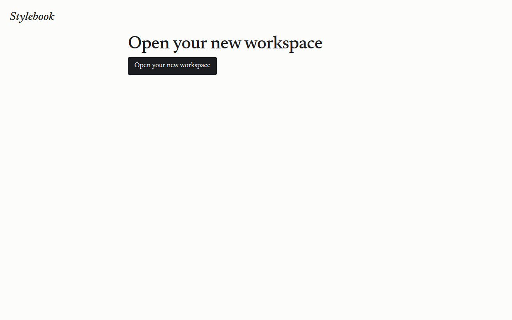
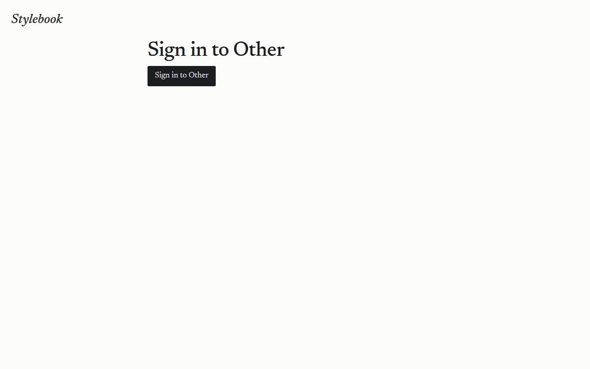
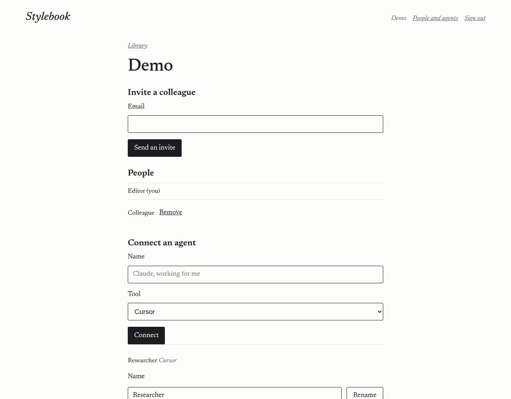
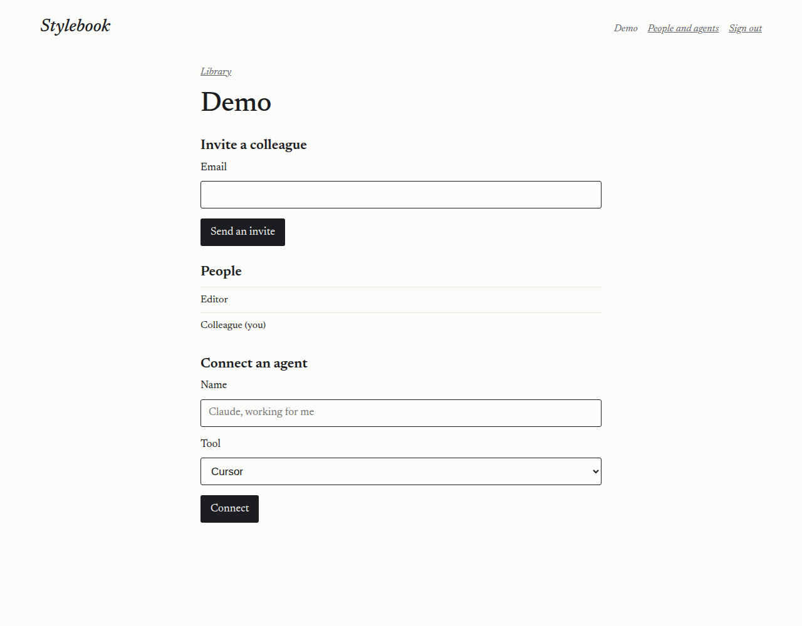
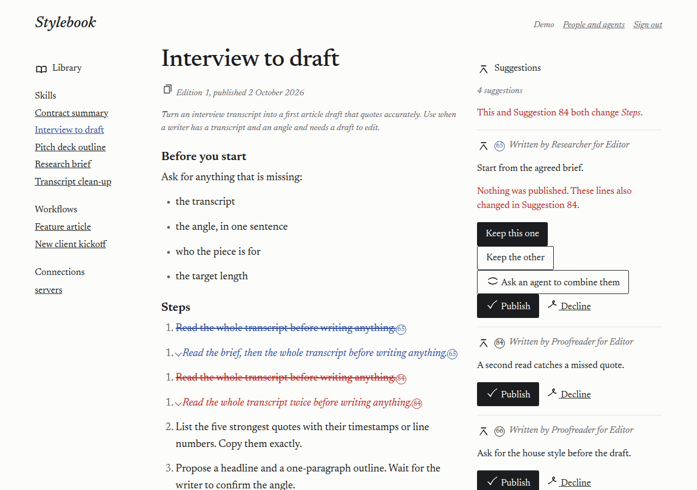
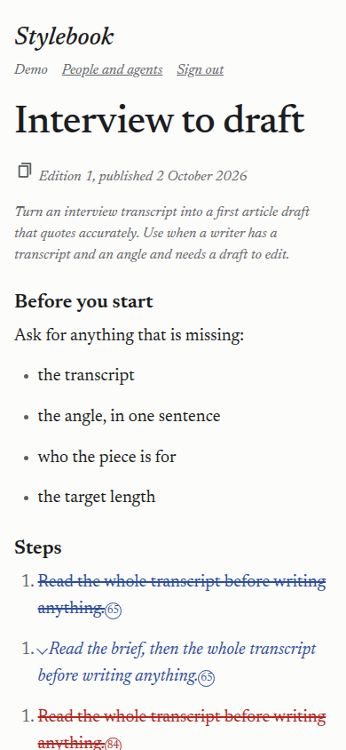

# 2026-10-02 — review fixes on the live service

A Cursor cloud agent ran this against https://stylebook.dev.

- Date: 2026-10-02, about 23:50 UTC, through 2026-10-03 00:10 UTC.
- Code that was deployed: `b95fa5116145065e925533e5e3e7dc2570362722`.
- Worker name: `stylebook`. Version `efd92e05-e073-438e-b630-0ec9888a7866`.
- Wrangler 4.147.0. The demo secret was not changed. Keys, addresses, and the workers.dev hostname are not recorded.

`wrangler d1 migrations apply stylebook --remote` applied `0006_owners.sql` (9 commands, success). That records an owner on each workspace, renames the Demo workspace's person from Demo to Editor, and copies that name onto the edition rows the page reads.

## Confirm page

A start link was stored the same way the Worker stores one (a SHA-256 hash, 15 minutes, single use) and opened with user agent `stylebook-live-run`. The typed name was a canary that must not appear.

- `GET /s/…` — 200, 6619 bytes, 179 ms. No `Set-Cookie`. The heading and the button both say "Open your new workspace". The canary is not in the page.
- The same `GET` again — 200, 6619 bytes, 27 ms. Still no cookie. Workspace count stayed 4.
- The link was then deleted. It was not posted, so no workspace was created.

A sign-in link for the person in the Other workspace (`w4oex6ht`):

- `GET /s/…` — 200, 6605 bytes, 69 ms. No cookie. The heading and the button both say "Sign in to Other".
- `POST /s/…` — 303, `Location: /`, `Set-Cookie` present (`HttpOnly`, `Secure`, `SameSite=Strict`). 208 ms. The cookie value is not recorded. The session row was deleted.
- The same `POST` again — 400. The page says "That link has expired or was already used."

## People page, owner and member

The Demo workspace is `wj6eoz0k`. Its owner is the person named Editor. A second person, Colleague, was added for this check and removed at the end. No address is recorded.

`GET /people` as Editor: 200. The page lists Editor (you) and Colleague. Colleague has Remove. Editor does not.

`GET /people` as Colleague: 200. The same two names. Neither has Remove.

`POST /people/remove` as Colleague, for Editor's id: 200. The page says "Only the person who started this workspace can remove someone." Editor is still in the workspace.

`POST /people/remove` as Editor, for Editor's own id: 200. The page says "The person who started this workspace cannot be removed."

## Header

`GET /?item=skills/interview-to-draft/SKILL.md` as Editor: 200, 31029 bytes. The page includes "Written by Researcher for Editor" and "Approved by Editor". It does not include "for Demo" or "Approved by Demo".

The header is one line, 1200px wide, the same width as the three columns and starting at the same left edge. Stylebook is at the left. Demo, People and agents, and Sign out are at the right, in graphite, 16px, on that same line. At 390px wide the account line wraps under the wordmark, still one line, left aligned with it.

## Sign-in replies and the workspace cap

Two `POST /sign-in` requests were sent together, one for an address that is in a workspace and one for an address that is not. Both returned 200. The bodies were identical, and both contain "If that address is in a workspace, a link is on its way." They returned in 131 ms and 16 ms.

`POST /start` for a new name returned 503 in 133 ms: "The sign-in email could not be sent. Try again in a little while." The canary name is not in that page. The workspace count stayed 4. The reservation and the stored link were removed afterward.

Public DNS for `stylebook.dev` still has no MX, SPF, or DKIM, as in the teams run. The send binding is deployed, and the send still fails before a letter can leave:

https://developers.cloudflare.com/email-service/configuration/send-bindings/

https://developers.cloudflare.com/email-service/configuration/domains/

The hour cap is one D1 insert that only writes when the counts are under the limit. A Workers Rate Limiting binding cannot hold an hour-long cap: its period is 10 or 60 seconds, and the counter is per location and eventually consistent.

https://developers.cloudflare.com/workers/runtime-apis/bindings/rate-limit/

https://developers.cloudflare.com/d1/worker-api/d1-database/#batch

The parallel cap, the per-email and per-IP workspace caps, and the 80% log line are covered by `test/review-fixes.test.ts`. This run did not create workspaces, so it did not cross 80% of 40.
