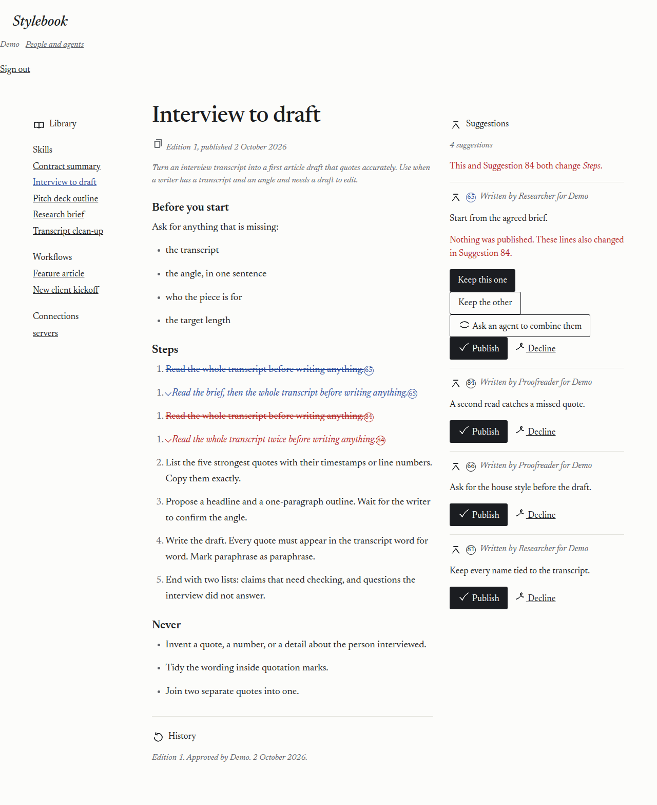
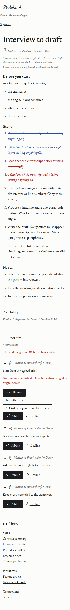
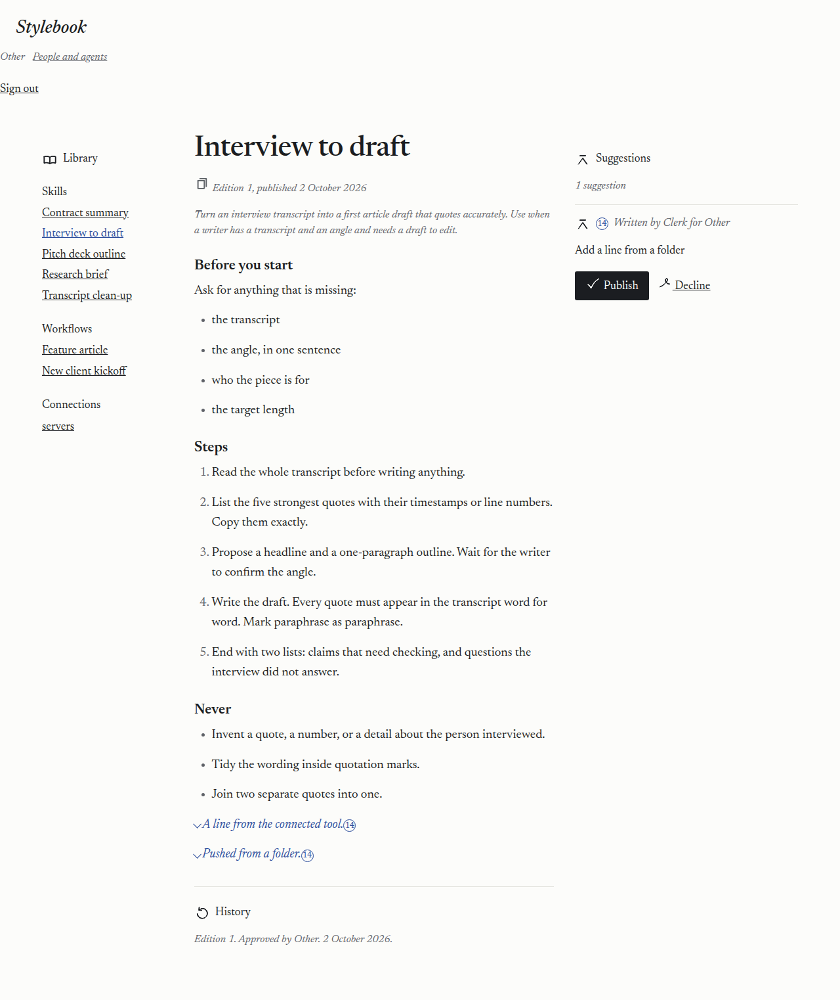
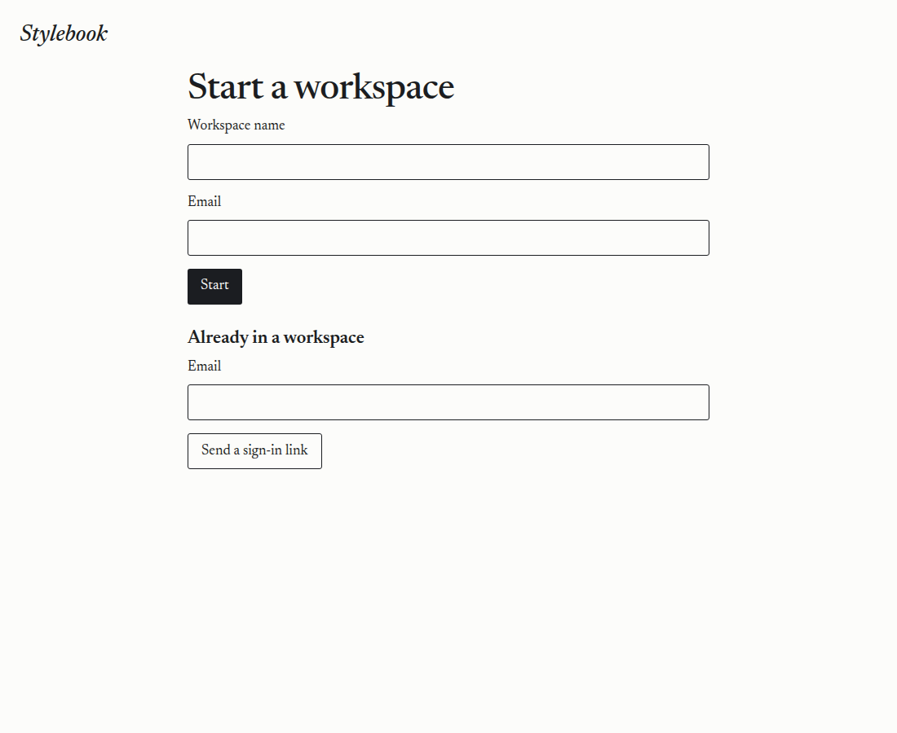
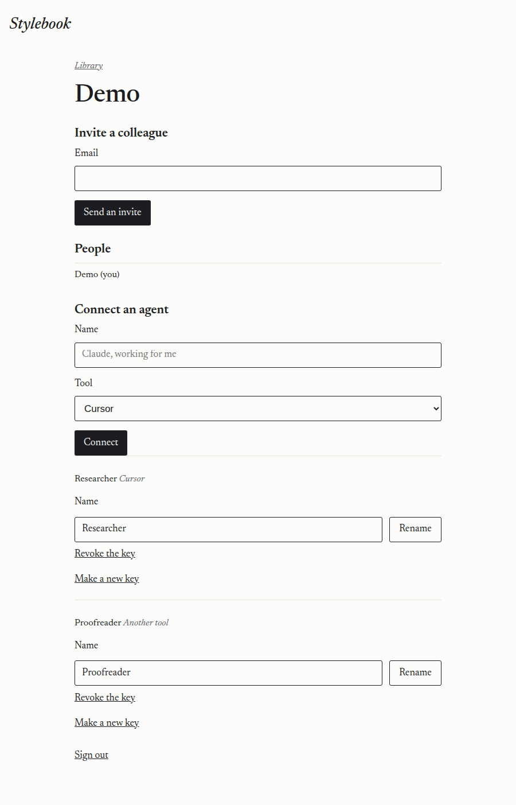

# 2026-10-02 — workspaces, sign-in, invites, and connecting an agent

A Cursor cloud agent ran this against the live Artifacts service and https://stylebook.dev.

- Date: 2026-10-02, about 23:00–23:15 UTC.
- Code that was deployed: `fa79decb316f28b59e1bcedae8540445f9a952b0`.
- Worker name: `stylebook`. Version `94c53058-6bec-4dfa-b511-17f1864a24c9`.
- Wrangler 4.147.0. The demo secret was not changed. Keys, addresses, and the workers.dev hostname are not recorded.

## One namespace, a prefix per workspace

The Workers binding is fixed to the namespace in `wrangler.toml`. Its methods take a repo name. They do not take a namespace:

https://developers.cloudflare.com/artifacts/api/workers-binding/

https://developers.cloudflare.com/artifacts/concepts/namespaces/

A workspace is therefore a prefix on every repo in the namespace `stylebook`: `{id}-library` and `{id}-sug-{actor}-{session}`. Repo names stay within the 63-character limit:

https://developers.cloudflare.com/artifacts/platform/limits/

The deploy reported one Artifacts binding, `env.WORKSPACE (stylebook)`, and one event trigger on that namespace. `stylebook-review` stays in the account, unbound. It was left where it was. It was not switched to read-only, and it was not deleted. `stylebook-demo` is the same.

Creating a repo in a namespace that does not exist yet creates the namespace. This deploy did not need a new namespace. The first library in `stylebook` was created by opening a workspace.

## Counting calls on the binding

The binding is an RPC stub. Taking a method off the stub and invoking it with `call`, `apply`, or `bind` asks the stub for a method of that name. The live log was `TypeError` and `The RPC receiver does not implement the method "call"`. The public binding docs do not describe this. Calling `stub[name](...)` keeps `this` on the stub, and the library page then opened.

Operation counts are written to D1 per workspace. After this run:

| Workspace | create | fork | get | read | write |
| --- | --- | --- | --- | --- | --- |
| Demo `wj6eoz0k` | 1 | 11 | 309 | 563 | 46 |
| Other `w4oex6ht` | 1 | 1 | 49 | 140 | 8 |

Two earlier workspace rows are also named Demo (`wksg6l0w`, `warisfv5`). Each has a person and no operation rows, so no library was created. They were left in place. The checks below use `wj6eoz0k` and `w4oex6ht`.

## Demo library

Opening the Demo session created the library and published edition 1 from the sample pages, through the library route, as the signed-in person.

`GET https://stylebook.dev/?item=skills/interview-to-draft/SKILL.md` with that session and user agent `stylebook-live-run` returned 200, 12164 bytes, in 1.116 seconds, before the suggestions existed. The page included "Interview to draft" and:

```
Edition 1. Approved by Demo. 2 October 2026.
```

It did not include "Someone" or "Revision notes". The word Steps appeared once.

A stock Git clone of `wj6eoz0k-library` with the Researcher's key exited 0. The file `skills/interview-to-draft/SKILL.md` contains one `## Steps` heading and does not contain "Revision notes". The clone also contained:

```
connections/servers.json
skills/contract-summary/SKILL.md
skills/interview-to-draft/SKILL.md
skills/pitch-deck-outline/SKILL.md
skills/research-brief/SKILL.md
skills/transcript-clean-up/SKILL.md
workflows/feature-article.md
workflows/new-client-kickoff.md
```

## Seeded suggestions

Researcher and Proofreader each received a key from "Make a new key". The key was in that response only. Both then called MCP `suggest_change` on https://stylebook.dev/mcp. All eleven saves returned `Saved suggestion`.

On Interview to draft, two suggestions change the same line of Steps ("Start from the agreed brief." and "A second read catches a missed quote."). The page says they both change Steps, and draws both on that line: the current sentence struck through, the new sentence in pencil, and a numbered ring. Two others change different parts of that page ("Keep every name tied to the transcript." and "Ask for the house style before the draft."). The other seven are single changes, each with its note, on Research brief, Transcript clean-up, Feature article, Pitch deck outline, and Contract summary.

History on the library is still only edition 1. The suggestions stay open.





`list_suggestions` for Interview to draft included "Start from the agreed brief." It did not include the other workspace's note.

## The other workspace

Other's library is `w4oex6ht-library`. Its page includes "Interview to draft" and "Edition 1. Approved by Other." It does not include "agreed brief" or "house style".

An agent named Clerk was connected there. The response showed the key once, with the Cursor or Claude Code setup and the folder setup. Clerk's MCP `list_suggestions` returned the note saved in Other ("Show that a suggestion arrives on the page.") and not the Demo notes.

Stock Git:

- Clone of Other's own library with Clerk's key: exit 0.
- Clone of the Demo library with Clerk's key: exit 128, `This key cannot open that copy.`
- Clone of a Demo suggestion with Clerk's key: exit 128, the same refusal.
- Clone of Clerk's suggestion, a new commit, and a push to `main`: exit 0. The suggestion repo name starts with `w4oex6ht-sug-`. Other's page then showed that note. Demo's list did not.



## Sign-in email

The send binding is deployed as `EMAIL`, allowed sender `sign-in@stylebook.dev`:

https://developers.cloudflare.com/email-service/configuration/send-bindings/

https://developers.cloudflare.com/email-service/api/send-emails/workers-api/

Public DNS for `stylebook.dev` has no MX, SPF, or DKIM on `cf-bounce`, and no TXT on `_dmarc`. Onboarding adds those records:

https://developers.cloudflare.com/email-service/configuration/domains/

https://developers.cloudflare.com/email-service/get-started/send-emails/

`POST /accounts/…/email/sending/domains` for `stylebook.dev` returned HTTP 404, error `10001`, "Unable to authenticate request". The public docs describe dashboard onboarding, not an API. Nothing was added to DNS.

`POST /start` therefore cannot deliver a link. Five calls for one address returned 503 and "The sign-in email could not be sent. Try again in a little while." The sixth returned 429 and "Too many sign-in emails were sent. Try again in an hour." `POST /invite` from inside Demo showed that same could-not-send sentence on the people page.

A link the Worker stores is a SHA-256 hash, single use, and expires in 15 minutes. Because the send throws after the row is written, the secret never leaves the Worker. The join was checked by inserting a row with those same columns and opening `/s/…`:

- First open: HTTP 303, `Set-Cookie` with `HttpOnly`, `Secure`, and `SameSite=Strict`. The next page was the Demo library, including "Start from the agreed brief."
- Second open of the same link: "That link has expired or was already used."
- A link whose expiry was already past: the same refusal.
- The stored `token_hash` is 64 hex characters and is not the secret.

Removing that person from the people page ended the session. The next request with their cookie was the start page, and their name was gone from the people list.





## Limits

The starting values are in `wrangler.toml`: 40 workspaces, 25 people, 40 agents, 200 open suggestions, 5 sign-in emails per address per hour, 20 per IP per hour.

https://developers.cloudflare.com/artifacts/platform/pricing/

The live sign-in cap returned the plain sentence above. The people, agent, suggestion, and workspace sentences are covered by the local tests, which run against the same messages.

## Rename and revoke

A spare agent was connected, renamed, and then its key was revoked. A later MCP read with that key returned JSON-RPC `-32001`, "Missing or unknown key." The spare agent was then taken off the people list so the Demo page shows Researcher and Proofreader. Proofreader was renamed back to that name before the seeded suggestions were saved, and a new key was issued for the seed.
