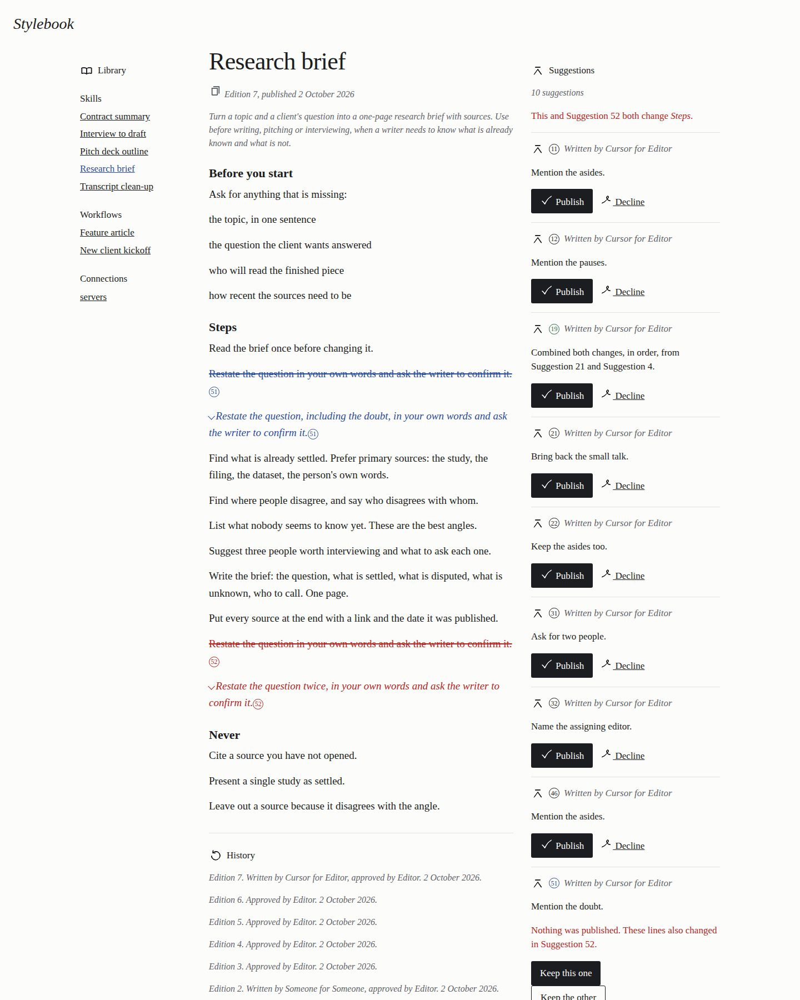
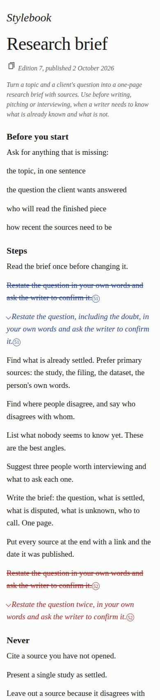
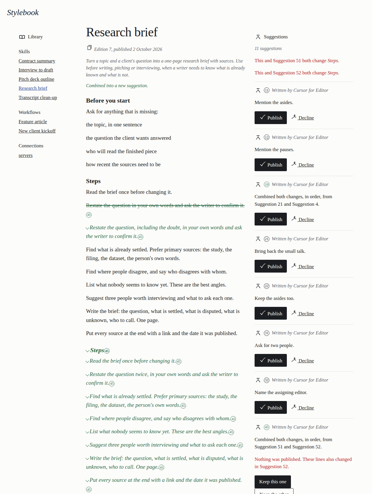
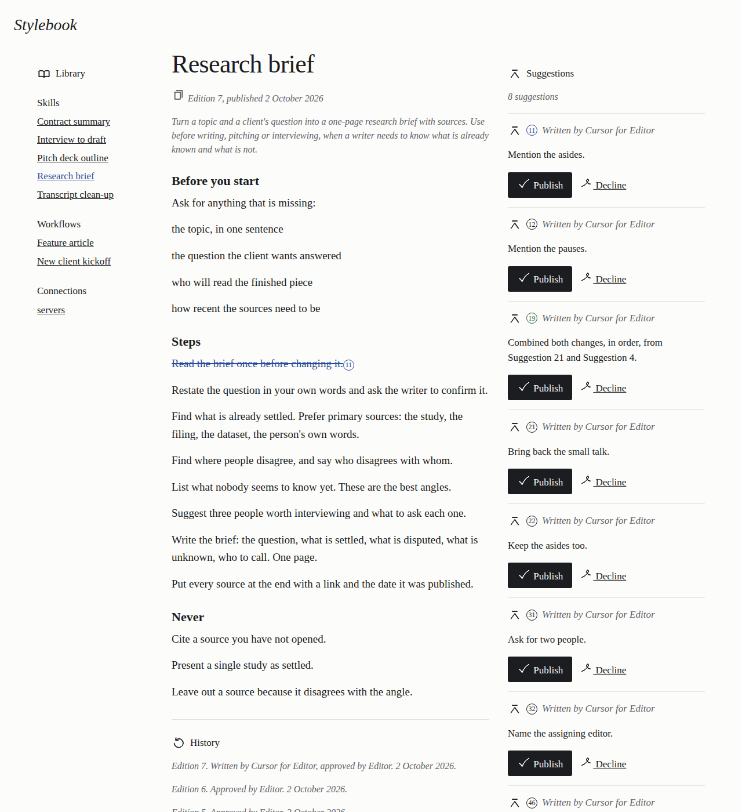

# 2026-10-02 — review screen

A Cursor cloud agent ran this against the live Artifacts service.

- Date: 2026-10-02, about 19:41–20:05 UTC.
- Code that was deployed last: `69107d272f9324dcf049a8defedb172464545b57`.
- Worker name: `stylebook`. Version `a2c95f63-2237-4c74-99c0-754843fd1afc`.
- Workspaces in config: `stylebook-demo` (the earlier library and its suggestion copies) and `stylebook-review` (the library this screen publishes).
- Wrangler 4.147.0. The D1 migration that records a declined suggestion was applied to the database named `stylebook` before the run.
- The worker hostname is written below as `stylebook.<subdomain>.workers.dev`. Keys are `<person-key>` and `<agent-key>`. None of those, and no account id, appeared in a response body.

Comparing and combining run in the Worker. The binding reads files. It does not host a diff or a merge:

https://developers.cloudflare.com/artifacts/api/workers-binding/

Writes still go through Git, with isomorphic-git on an in-memory file system:

https://developers.cloudflare.com/artifacts/examples/isomorphic-git/

A note is stored on `refs/notes/stylebook`, not in the edition:

https://developers.cloudflare.com/artifacts/concepts/best-practices/

## Sign in

`GET /` with no key returned the sign-in page (200). `POST /sign-in` with the person's Stylebook key returned 303. The cookie was `HttpOnly`, `Secure`, and `SameSite=Strict`.

`GET /who?edition=7605a6f73ec3ae8f531da671414552ef0978f9de` with no key returned 401:

```json
{"ok":false,"error":"Missing or unknown key."}
```

The same request with the person's key returned 200. The actor and the owner were both the person named Editor. The body had no remote and no key.

An agent key can open the page. The page says Locked and does not offer Publish.

## The library

The first signed-in `GET /` took 21.9 seconds and returned 200 (726 KB). It published the sample library as edition 1 of the review workspace and drew the open suggestion copies already in the earlier workspace. The page showed Interview to draft, Feature article, and 185 suggestion cards. History said "Edition 1. Approved by Editor. 2 October 2026."

Those cards are the copies made when many agents suggested changes at once. The screen reads both workspaces, because a copy made with `fork()` stays in the workspace it was made from:

https://developers.cloudflare.com/artifacts/concepts/best-practices/

One of those copies was published. `POST /publish` returned 303 in 9.1 seconds:

```
/?item=skills/interview-to-draft/SKILL.md&notice=Published as edition 2.
```

The page then showed the published line ("including the small talk") and History. That copy had no note the screen could read, so History said "Written by Someone for Someone, approved by Editor."

A later publish, of a suggestion saved by Cursor for Editor, is edition 7. `7f7674876e733046140b63a5a470b5428770cbdf` is the edition. `a2e6835ae00c7c1a711b6ee360dfaad69baed764` is the note. History says "Edition 7. Written by Cursor for Editor, approved by Editor. 2 October 2026." The page shows the published sentence "Read the brief once before changing it." `GET /who` for that edition, with the person's key, returned the person as the actor and this note:

```json
{"actor":"Cursor","onBehalfOf":"Editor","intent":"Add a first read."}
```

## Overlap, and the three ways out

Two suggestions changed the same line of Steps. The page said "This and Suggestion 12 both change *Steps*." The suggestion being read was blue. The other was red. The page offered Keep this one, Keep the other, and Ask an agent to combine them.

`POST /publish` of that suggestion returned 303 and did not publish:

```
Nothing was published. These lines also changed in Suggestion 2.
```

Keep the other returned 303: "Kept the other. Published as edition 3."

Ask an agent to combine them does not call a hosted model. It writes a new suggestion whose text keeps both changes, in order. One combined copy was `sug-pencil-combine-51-52-2f2e5e`. The page drew that suggestion in green and said "Combined both changes, in order, from Suggestion 51 and Suggestion 52." Publishing a combined suggestion returned "Published as edition 4."

## Two publishes at once

Two suggestions changed different lines of Feature article. Both `POST /publish` calls ran together. Both returned 303, as edition 5 and edition 6. The page then contained both "Book two people" and "assigning editor". The second send was retried against the new edition. Neither change was lost.

## What the docs do not say, and what was observed

A shallow clone of `main` does not include `refs/notes/stylebook`. Adding a note from that clone and sending it is refused once a notes ref already exists, because the new note is not based on the note that is already there. The edition itself had already been accepted. Fetching the notes ref, pointing the local ref at it, and adding the note on top lets the next note send. The public best-practices page says to keep notes on `refs/notes/*`. It does not say that a shallow clone of `main` leaves that ref out.

The first signed-in page, with 185 open copies, took 21.9 seconds and still returned 200. Later pages with the same copies took about 8 to 12 seconds.

`/git/library.git` is the earlier workspace's library. The review library has the same name in the other workspace, so the screen writes that library with a short-lived repo token after the same permission check the Git route uses, and records the person in the same audit table. Suggestion copies that exist only in the review workspace are still opened through the Git route.

## Screenshots

Wide screen. Blue is the suggestion being read. Red is another suggestion on the same lines.



The same page at phone width. The page is first, then the suggestions, then the library.



A combined suggestion, in green, and History naming who wrote it and who approved it.





## Failures and retries

Saving a suggestion returned 500 while the edition and the note ref were already on the copy. The note send was reported as refused, and that error was treated as a failed save. After the note is allowed to fail without undoing the edition, and after a later note is based on the notes ref that is already there, `POST /suggestion` returned 200. One of those responses was `sug-pencil-t4-041`, edition `d705dc1f3e6597030a9be28ff9ee5c11932c2dae`.
