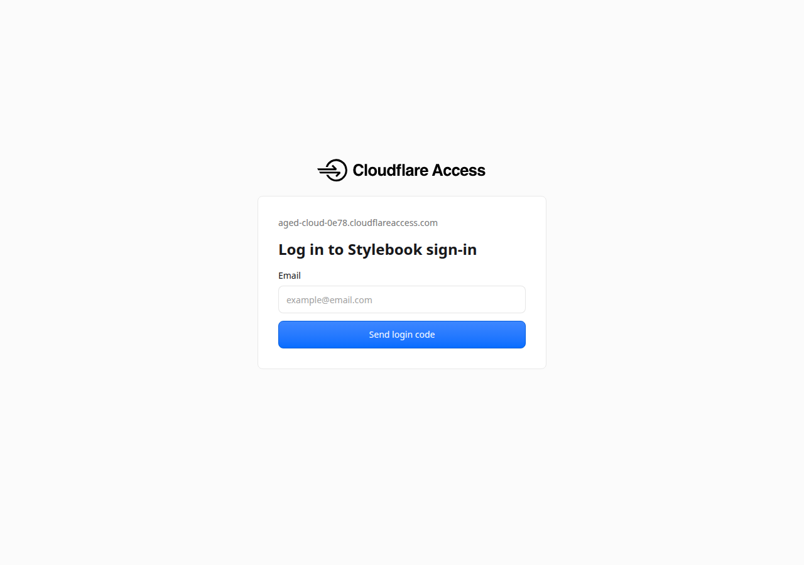
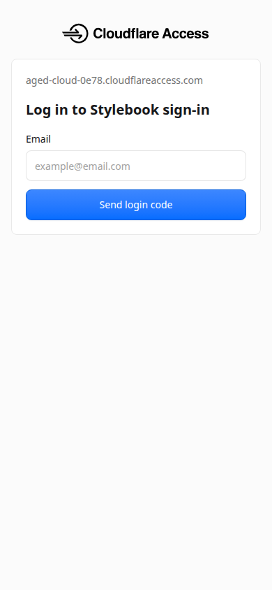
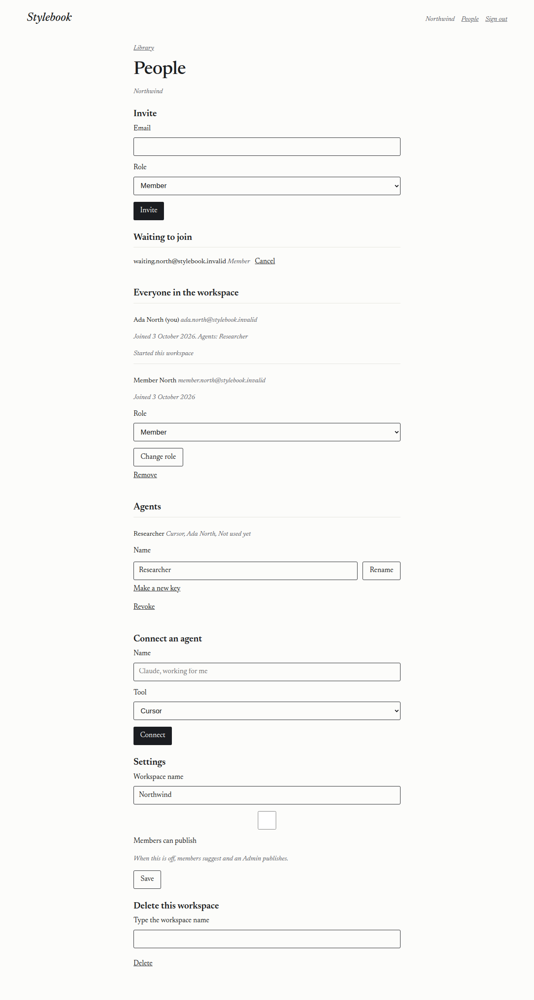
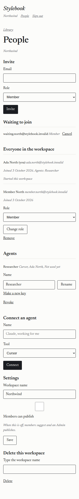
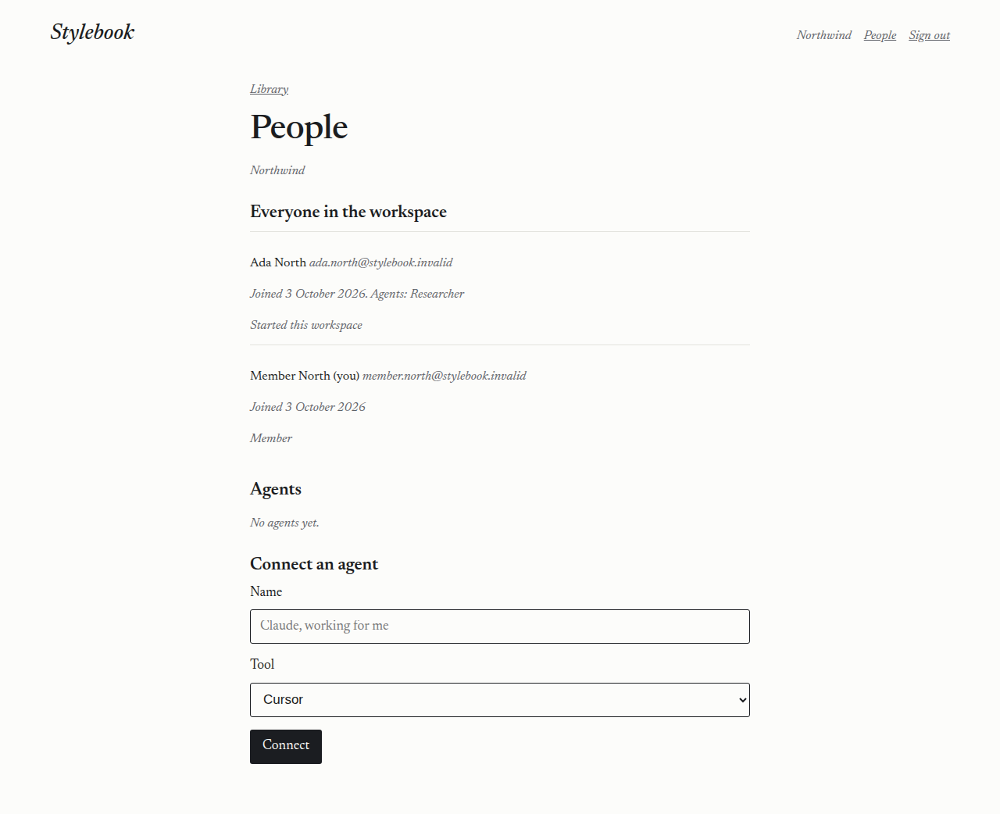
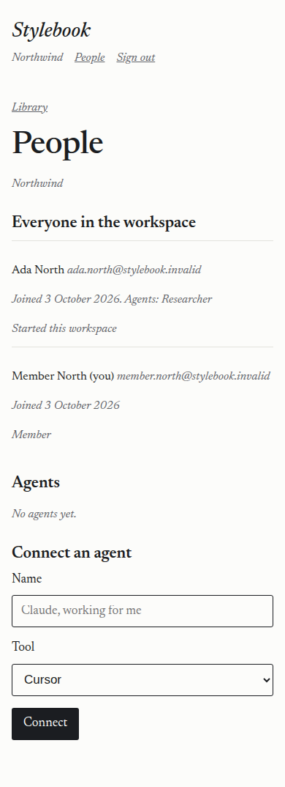

# 2026-10-03 — Access sign-in, two roles, and People

A Cursor cloud agent ran this against https://stylebook.dev.

- Date: 2026-10-03, about 01:25 UTC through 01:35 UTC.
- Code that was deployed: `784329ec30cc42c01d24c82072e266b1fc6ae929`.
- Worker name: `stylebook`. Version `07cb2d41-a7df-490a-a64a-f2c703789177`.
- Wrangler 4.147.0. The demo secret was not changed. Keys, addresses, the team host, and the workers.dev hostname are not recorded.

`wrangler d1 migrations apply stylebook --remote` applied `0007_roles.sql` (16 commands, success). That adds Admin and Member, the "Members can publish" switch, locked pages, invitations, the monthly sign-in count, and the service-admin audit.

## What stayed public

Checked with user agent `stylebook-live-run`. None of these asked for Cloudflare Access.

| Request | Status | What came back |
| --- | --- | --- |
| `GET /health` | 200 | `{"ok":true,"name":"stylebook"}` |
| `GET /` | 200 | The Stylebook sign-in page, with a link to `/enter`. It does not contain the library. |
| `GET /mcp` | 405 | "Use POST for this endpoint." |
| `POST /mcp` with `initialize` | 200 | The Stylebook tool list handshake. |
| `GET /git/demo-library.git/info/refs?service=git-upload-pack` | 401 | "Missing or unknown key." |
| `GET /admin` with no identity | 404 | "That page is not available." No workspace name and no operation count. |

There is no "Try the demo" route in this tree yet. `GET /` is the public page.

`POST /sign-in` is the old email-link route. With Access switched on it returns 404 and the sign-in page. The link code remains in `src/mail.ts`.

## Sign-in

The Access application is named Stylebook sign-in. It covers `stylebook.dev/enter` only. One-time PIN was already an identity provider on the account, so this run did not add another. The policy is Allow, and its include rule is that login method. The [policies guide](https://developers.cloudflare.com/cloudflare-one/access-controls/policies/) says an Include rule for the one-time PIN login method lets anyone with a verified email through. Stylebook then decides which workspace they see.

The application was created with the Access API. The token could list identity providers and applications, and the create returned 201. `TEAM_DOMAIN`, `POLICY_AUD`, and `SERVICE_ADMINS` are Worker secrets. They are not in the repo.

`GET /enter` returned 200, 46372 bytes. The title is "Sign in ・ Cloudflare Access". The page asks for an email and offers to send a code. The words "one-time PIN" are not on that first screen. This run did not submit an address or a code, because that needs a mailbox. The Worker checks `Cf-Access-Jwt-Assertion` against the team certs, the issuer, and the application audience, and it does not read `Cf-Access-Authenticated-User-Email`. That check is covered by the local tests with a test key. The docs are [Validate JWTs](https://developers.cloudflare.com/cloudflare-one/access-controls/applications/http-apps/authorization-cookie/validating-json/) and [Cloudflare Access for Workers](https://developers.cloudflare.com/workers/configuration/cloudflare-access/). The Workers page also exposes an identity the platform has already checked. The code accepts that too.

`POST /sign-out` with a Stylebook session returned 303 to `/cdn-cgi/access/logout` on the Access host, and cleared the Stylebook cookie. That ends both sessions.

## People

A temporary workspace was created for these pictures, with stand-in names, and then removed. No real address is in the pictures.

As an Admin the page shows Invite (Member selected, Admin available), a waiting invitation with Cancel, everyone in the workspace, the starter marked "Started this workspace" with no role control and no Remove, agents with Revoke, the "Members can publish" switch, and delete by typing the name. The line under the switch says "When this is off, members suggest and an Admin publishes."

As a Member the same list is visible, including "Started this workspace". Invite, Cancel, Change role, Remove, the switch, and delete are not on the page. Connect an agent is.

The three ways out of an overlap (Keep this one, Keep the other, Ask an agent to combine them) are one column of equal-width buttons, and one row from 1100px wide. That layout is in the page style. These pictures are the People page, which does not show an overlap.

## Deleting a workspace

The [Workers binding](https://developers.cloudflare.com/artifacts/api/workers-binding/) documents `delete(name)`. Deleting a workspace calls that for the library and for each suggestion copy, then marks the workspace gone and removes keys and sessions.

A throwaway workspace was opened, which created its library. `GET /` returned 200 and the page contained "Interview to draft". The copy was listed by name and its status was `ready`. `POST /workspace/delete` with the workspace name typed in returned 303 to `/`. A second list had no copy under that workspace. The session used for the People pictures was removed afterwards. `GET /people` with that cookie then returned 401 and the sign-in page, which did not contain the workspace name.

The estimated cost on `/admin` uses the published prices: the first 10,000 operations in a month are included, then $0.15 per 1,000. The first 1 GB-month is included, then $0.50 per GB-month. Storage is not counted per workspace. [Artifacts pricing](https://developers.cloudflare.com/artifacts/platform/pricing/). The live `/admin` page was not opened with a service-admin identity in this run. The local tests check that it shows counts and the estimate and does not show names, addresses, or library text.

## Colleague

On the Demo workspace `wj6eoz0k`, the person named Colleague was already marked removed. This run deleted any keys and sessions still stored for that row. The address was not read.

## Checks before the live run

`npm run typecheck` passed. `npm test` passed: 9 files, 80 tests.
