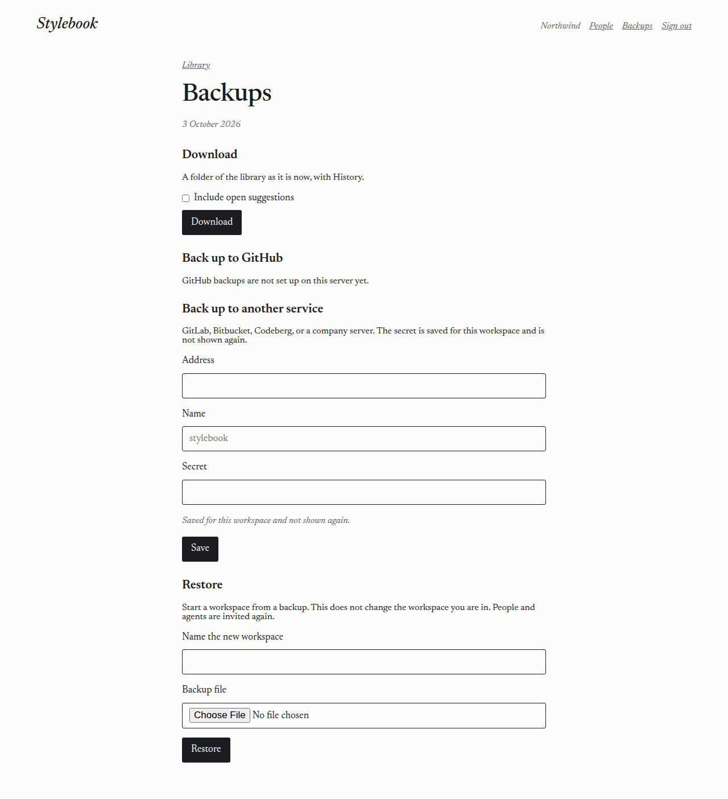
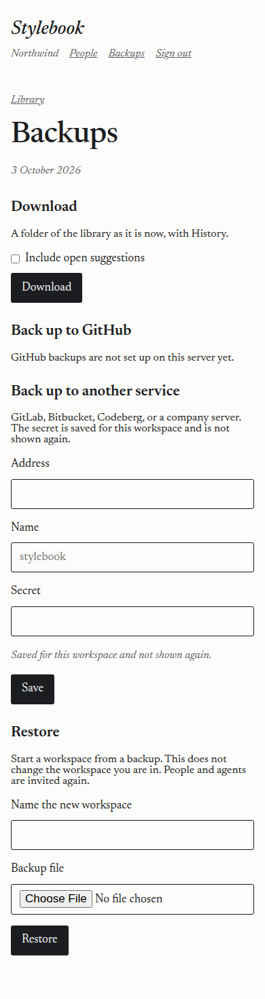
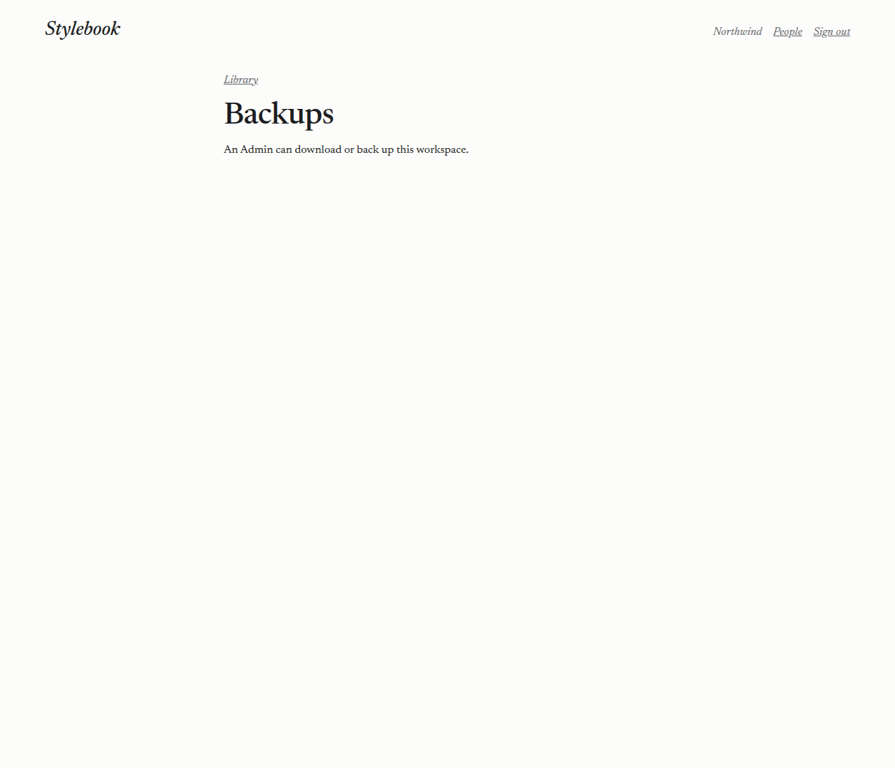
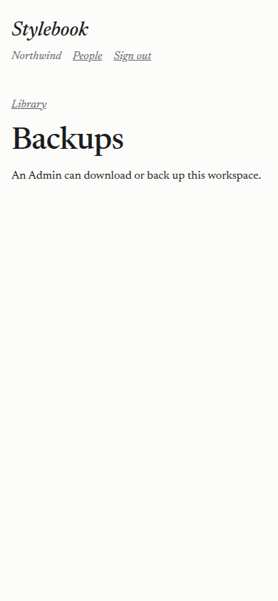

# 2026-10-03 — Download, back up, and restore

A Cursor cloud agent built this on a branch, then applied the review of that work. The local checks below ran after merging the tool-connections change.

## What this pass changed

The branch was behind `main`. This pass merged that history. The backup tables are `migrations/0011_backups.sql`. `0009` and `0010` stay the tool-connection migrations. There is one zip writer, `src/zip.ts`: a stored archive for a skill folder, a download, and a restore.

A GitHub installation is saved only after GitHub lists that id for the person who just authorized the app. The manifest sets `request_oauth_on_install` to true. The browser lands on a page on this site and finishes the connection with a button, because a Strict session cookie is not sent on the cross-site return. An installation already used by another workspace is refused. A forged id is refused, and nothing is saved.

A restore keeps `HEAD`, `refs/`, `objects/`, and `packed-refs` from the uploaded history, and writes a fresh config. Clone, fetch, and push pass an empty proxy so a config in the upload cannot redirect a later send. Loose objects and packfiles are inflated under a byte budget, and inflation stops once that budget is passed. The cap is `MAX_BACKUP_INFLATED_BYTES`, 80000000 in the Worker config.

An address for another service has to be `https`. An IP address, a loopback or private host, `artifacts.cloudflare.net`, and this site's own hosts are refused. The send does not follow a redirect.

A read-only workspace can still be downloaded. Changing a backup, sending one, and restoring are refused. An installation token asks for contents write, and for one repository when the name is known. The download checks the library size before it builds the archive.

GitHub backups stay on "GitHub backups are not set up on this server yet" until the app secrets exist. The manifest and the setup steps are on the issue. A live push to GitHub waits on that app.

## What the local run showed

`npm run typecheck` passed. `npm test` passed: 11 files, 119 tests.

The download test, against the local stand-in for the binding, logged:

| Download | Bytes | Time |
| --- | --- | --- |
| Library, History, people, and open suggestions | 32726 | 119 ms |
| Same library without open suggestions | 23662 | 73 ms |

The zip opened as a folder with `HISTORY.md`, `people.md`, and `ABOUT-THIS-BACKUP.md`. `git log` listed both editions. `git notes --ref=stylebook` showed the note. A scan of the zip found no email address, no agent key, no session secret, and no `art_v1_` or `sbk_` value. Restoring that zip started a new workspace with the same files, the same number of editions, and the same note. The original library tip did not change. The new workspace had one Admin, the person who restored it.

A zip whose config named a proxy host restored the same way. No request was sent to that host, and the new library's config had no proxy.

A stored zip of a few kilobytes, with one object that expands to 80000 bytes, was refused when the budget was 1000. The page said "This backup expands to more than Stylebook can restore." No workspace was created.

The other-service form accepts only an `https` address. The test saved `https://codeberg.org/northwind/library.git`, checked that the secret was encrypted, then pointed that saved row at the local Git server for the send. The ciphertext did not contain the secret. "Back up now" updated only `refs/heads/stylebook` and `refs/notes/stylebook`. An existing `main` on that server was left as it was. After "Keep it up to date", the push-triggered arrival Workflow sent the library again. Disconnect stopped later sends. A history the workspace did not write was left in place, and the page said "This backup has changes that are not in the workspace. Nothing was sent." The same send, with the secret encrypted on a GitHub-shaped row whose address was the local server, updated only `stylebook`.

A download over the configured cap (the test set it to 500 bytes; the Worker config is 20000000) returned "This workspace is larger than a backup can hold." A file that is not a Stylebook backup returned "This is not a Stylebook backup." An upload over the cap returned "This backup is larger than Stylebook can restore."

A read-only workspace still downloaded. Saving another service and restoring both returned "This workspace is read-only."

Members and agents received 403 on every backup route. A member opening Backups got "An Admin can download or back up this workspace." Each download, backup change, and restore wrote a workspace audit row with who and when. Refusing a GitHub connection wrote one too.

The pictures are the Backups page the Worker serves, wide (1280) and phone (390), with stand-in names. No address is in the pictures. The Admin page has Download, GitHub, another service, and Restore. The member page is the one sentence.

## Docs used

The download clones the library with isomorphic-git, the approach in the [isomorphic-git example](https://developers.cloudflare.com/artifacts/examples/isomorphic-git/). Notes stay on `refs/notes/stylebook`, which is the pattern in [Best practices](https://developers.cloudflare.com/artifacts/concepts/best-practices/). The binding reads repos and does not write files, so the restore sends history with Git, as that example does. The namespace is the one in [the Workers binding](https://developers.cloudflare.com/artifacts/api/workers-binding/). "Keep it up to date" runs from the existing push Workflow described in [Build and deploy on push](https://developers.cloudflare.com/artifacts/guides/build-and-deploy-on-push/). Retries are inside the send. A failing backup does not fail the arrival. Workflow step retries are documented in [Sleeping and retrying](https://developers.cloudflare.com/workflows/build/sleeping-and-retrying/).

The other-service secret is encrypted with `BACKUP_KEY`, a Worker secret. [Secrets](https://developers.cloudflare.com/workers/configuration/secrets/) are set with `wrangler secret put` and are not in the repo. The 20 MB caps and the inflate budget are Worker vars in `wrangler.toml`, not an Artifacts limit. Artifacts pricing is separate: [Pricing](https://developers.cloudflare.com/artifacts/platform/pricing/).

`corsProxy` overrides the proxy named in a repository config. Passing null skips that config. See [isomorphic-git push](https://isomorphic-git.org/docs/en/push).

GitHub App registration from a manifest, including `request_oauth_on_install`: [Registering a GitHub App from a manifest](https://docs.github.com/en/apps/sharing-github-apps/registering-a-github-app-from-a-manifest). The user access token from that authorization: [Generating a user access token](https://docs.github.com/en/apps/creating-github-apps/authenticating-with-a-github-app/generating-a-user-access-token-for-a-github-app). The installations that token can see: [List app installations accessible to the user access token](https://docs.github.com/en/rest/apps/installations#list-app-installations-accessible-to-the-user-access-token). The app JWT: [Generating a JSON Web Token (JWT)](https://docs.github.com/en/apps/creating-github-apps/authenticating-with-a-github-app/generating-a-json-web-token-jwt-for-a-github-app). The short-lived installation token, minted per send and not stored, with `repositories` and `permissions`: [Generating an installation access token](https://docs.github.com/en/apps/creating-github-apps/authenticating-with-a-github-app/generating-an-installation-access-token-for-a-github-app). The manifest asks for contents write only: [Choosing permissions](https://docs.github.com/en/apps/creating-github-apps/registering-a-github-app/choosing-permissions-for-a-github-app). Requests send `X-GitHub-Api-Version: 2026-03-10`, the current version in [API versions](https://docs.github.com/en/rest/about-the-rest-api/api-versions). Stylebook never creates a public repository.
