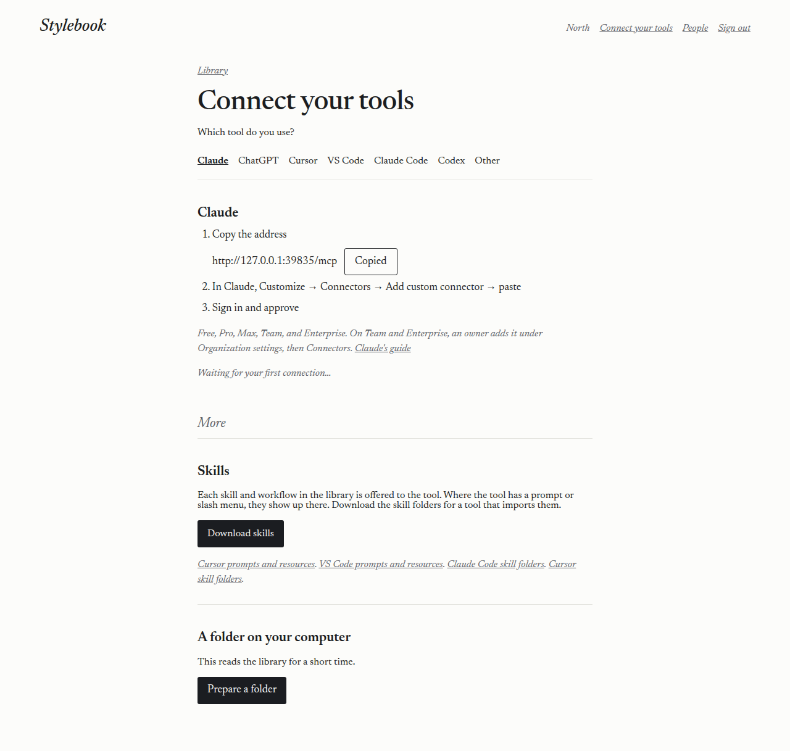
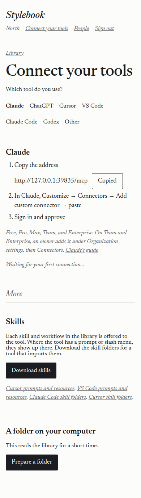
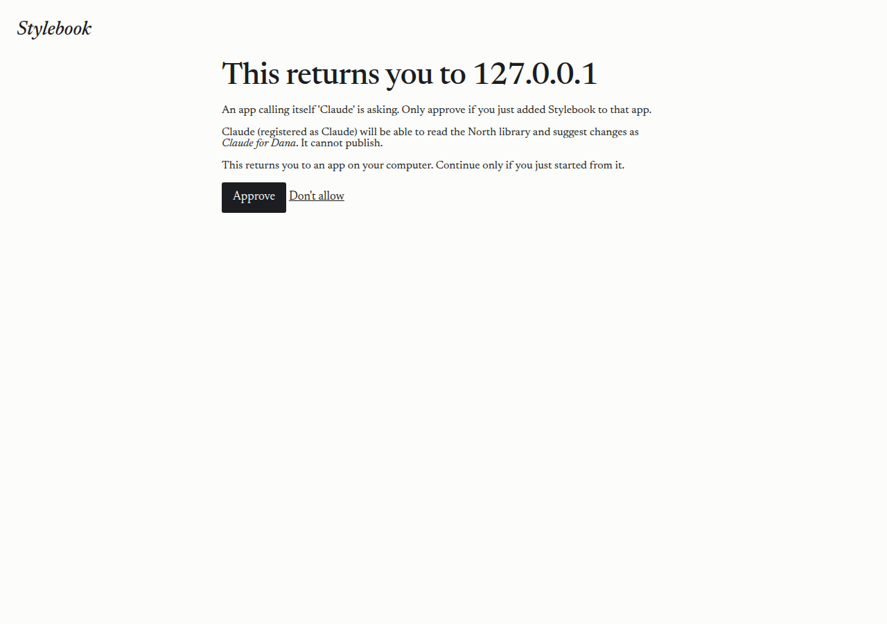
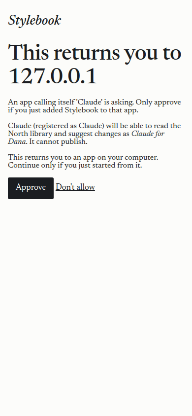
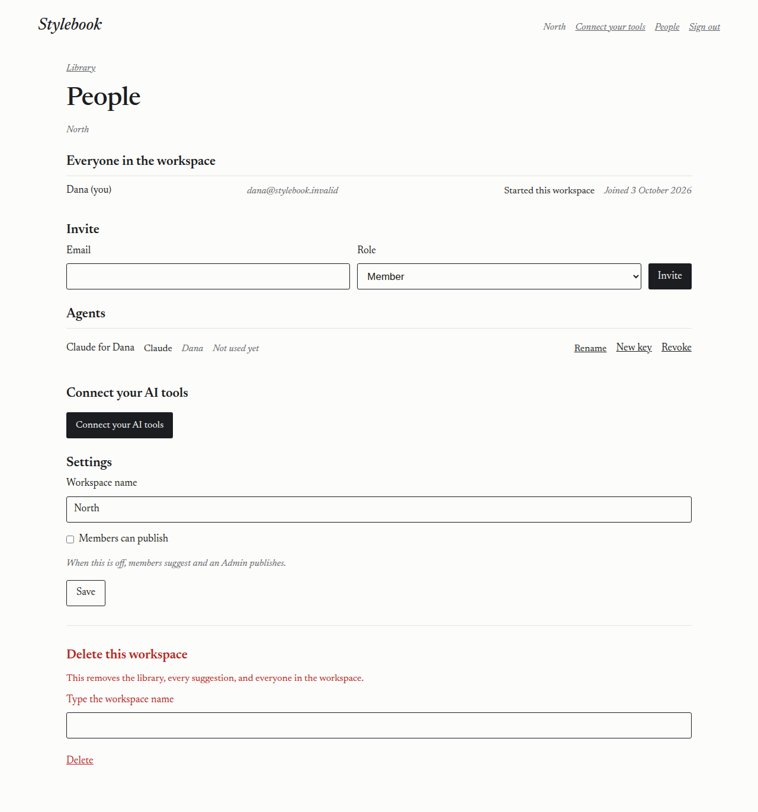
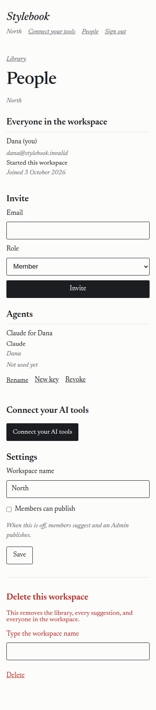

# 2026-10-03 — Connect your tools

A Cursor cloud agent ran this against https://stylebook.dev, then updated the pictures on the local server.

- Date: 2026-10-03, about 05:30 UTC through 05:49 UTC.
- Worker name: `stylebook`. Version `2ec3fb19-b96b-41c7-9282-d57e8b5db453`, created 2026-10-03T05:48:06Z. Wrangler 4.147.0.
- Code that was deployed: `c9fbc732d5d0eff2c787a23a5b47929ccbd58492`. The deploy ran from that tree, and the commit was made after the live pass.
- The demo secret was not changed. No address, account id, team host, or workers.dev hostname is recorded here.

An earlier pass on this branch had no Cloudflare login, so it stopped before deploy. This pass found the API token and continued.

## What was deployed

`npx wrangler kv namespace create` created a namespace titled `stylebook-OAUTH_KV`. The binding name in `wrangler.toml` is `OAUTH_KV`, which is the name the Worker reads. An older namespace with a different title was left alone. KV is included in Workers Paid. See [KV](https://developers.cloudflare.com/workers/runtime-apis/kv/).

`npx wrangler d1 migrations apply stylebook --remote` applied `0009_connectors.sql` (the tool version on an agent) and `0010_oauth_agents.sql` (the registration counter, and which app is tied to which agent). Both reported success.

`npx wrangler deploy` published the Worker. A call to `POST /mcp` with no credential returned 401, and `WWW-Authenticate` named the resource metadata for `https://stylebook.dev/mcp`.

## Sign-in from the tool

Sign-in uses the [Workers OAuth Provider](https://github.com/cloudflare/workers-oauth-provider) in front of `/mcp`, with Cloudflare Access as the identity. That is option 1 in [Authorization](https://developers.cloudflare.com/agents/model-context-protocol/protocol/authorization/).

The first live attempt reached Access, then the browser reported that stylebook.dev redirected too many times. Access returns the person from another site. A redirect that sets a Strict session cookie is not sent on the next request, so the approval page sent them back to sign in, and the two pages chased each other. [Set-Cookie](https://developer.mozilla.org/en-US/docs/Web/HTTP/Reference/Headers/Set-Cookie#samesitesamesite-value) describes that Strict behaviour. The fix is a normal page that sets the cookie and offers Continue, with a refresh to the return address. That page was deployed as the version above. The session cookie itself stays Strict.

The client used for the live pass was an MCP client, the nearest tool available here. Claude's own app was not installed. The client was given only the address `https://stylebook.dev/mcp`. It registered as a public app named Claude, with no client secret, and opened the approval address itself. That is the same shape as a custom connector: one address, then sign-in.

Clicks, on stylebook.dev, 2026-10-03:

1. The tool opened Stylebook. Cloudflare Access asked for the email and a one-time code, the same sign-in as the site.
2. After the code, the consent page was the next screen. The heading was "This returns you to 127.0.0.1", the tool's own callback on this computer. The page said an app calling itself 'Claude' is asking, and to approve only if Stylebook was just added to that app. It then said Claude (registered as Claude) will be able to read that workspace's library and suggest changes as Claude for Aaron, and that it cannot publish. It also warned that the return is an app on this computer.
3. Approve.

From the consent page being ready until the tool received the return: **1020 ms**. The code was submitted at 05:48:49.900Z, the consent page was there in the same second, and Approve finished at 05:48:50.926Z.

That is one address, sign in, Approve. On the Connect page the same path is: open Connect your tools (Claude is already selected), Copy, paste that address in the tool, sign in, Approve.

## What the live service did

- The tool received a credential. `initialize` returned 200. The server name was stylebook, version 0.1.0, and it offered tools, prompts, and resources. The client named itself Claude, version 1.2.3.
- `list_library` returned the library pages, including the skill files and `connections/servers.json`.
- `suggest_change` on `skills/interview-to-draft/SKILL.md` saved a suggestion as edition `ab895ca77ebfa022e23ac381d44af6d5e6971a78`.
- The recorded row for that edition names the agent Claude for Aaron, the person Aaron, and the tool Claude. The agent row stores client version `1.2.3` and a last-used time.
- People listed Claude for Aaron beside an older connection. Revoke for Claude for Aaron returned 200. That agent then had no key left.
- The next call with the same credential returned 401, "Missing or unknown key." The whole pass finished at 05:49:03.039Z.

## What changed after the review

The approval page shows the app's own registered name, escaped, beside the friendly name. The return address is the heading. Approving again from the same app reuses that agent. A different app gets a new one, such as "Claude for Dana (2)". A key made by hand is not replaced.

The approval sentence names the workspace. The form posts that workspace, and the Worker rejects it unless it is the one in the session. Switching workspace is a submit, not a side effect of opening the page.

New app registrations may only use the public sign-in method, so each one has to prove the exchange. The name is capped at 80 characters and the return addresses at 8. More than 30 registrations an hour from one network are refused. The counter is the same kind of D1 row as the other limits.

The skill download skips a name that contains `..` or `\`, or that starts with `/`. It stops at 200 files or 8 MB, and it marks each name as UTF-8.

The Connect page starts with "Which tool do you use?" Claude, ChatGPT, Cursor, VS Code, Claude Code, Codex, and Other. Claude is selected until the person picks another, and that choice is remembered. Only that tool's steps show. They are numbered: copy the address, the menu path, then sign in and approve. The address has a Copy button that changes to Copied. Download skills, a folder on your computer, and the team's other servers sit under More. A name in `connections/servers.json` is capitalised for display. The stored name is unchanged.

## What the local server did

With the test store in place, the same checks as the first pass on this branch still hold, plus the review fixes:

- A signed-out visit to the approval address redirected to `/enter` and remembered the return address.
- Approving created an agent named Claude for Dana. The page did not show a key.
- The saved suggestion's note named Claude for Dana, on behalf of Dana, and the model line included `1.2.3`.
- After that call the Claude steps read "Connected as *Claude for Dana*".
- Skills and workflows came back as prompts. `get_skill` returned the interview skill. The skill download was a zip of the `skills/*/SKILL.md` files and did not include workflows.
- `list_team_connections` returned the Notion address from `connections/servers.json` and did not return a credential. A query or a sign-in embedded in an address is dropped before it is shown.
- Calling publish returned "An agent cannot publish."
- Revoke on People, then the same credential, returned 401.
- A posted approval for a different workspace was refused, and the approval handle still worked for the workspace on the page.
- A registration with a long name, too many return addresses, or a client secret was refused. The 31st registration from one network was refused.
- A second app did not take over the first app's agent, and a hand-made key was still the same after an approval.

`npm test`: 10 files, 94 tests, passed. `npm run typecheck` passed.

## Cards

Each card follows that vendor's current docs. Where the docs have no one-click install for a server you host yourself, the card is the address and sign-in.

| Tool | What the card does | Docs |
| --- | --- | --- |
| Claude | Copy the address. Customize, Connectors, Add custom connector, then sign in. Free, Pro, Max, Team, and Enterprise can use a custom connector. On Team and Enterprise an owner adds it first under Organization settings, then Connectors. | [Custom connectors](https://support.anthropic.com/en/articles/11175166-getting-started-with-custom-connectors-using-remote-mcp) |
| ChatGPT | Paste the address and sign in. Full connectors are in beta on Business, Enterprise, and Edu. Plus, Pro, and Free are not listed for this. | [Developer mode and MCP apps](https://help.openai.com/en/articles/12584461-developer-mode-and-mcp-apps-in-chatgpt) |
| Cursor | Paste the address in Customize, then sign in. Cursor documents sign-in for streamable HTTP, and a marketplace install, not a one-click link for a server you host. | [MCP](https://cursor.com/docs/mcp) |
| VS Code | One click uses the documented `vscode:mcp/install` link, then sign in. The link carries no credential. | [MCP servers](https://code.visualstudio.com/docs/agent-customization/mcp-servers), [install link](https://code.visualstudio.com/api/extension-guides/ai/mcp) |
| Claude Code | One line: `claude mcp add --transport http stylebook <address>`, then sign in. | [MCP](https://code.claude.com/docs/en/mcp) |
| Codex | Settings, MCP servers, Add server, Streamable HTTP, paste the address, then sign in. The documented add example is not an HTTP URL flag, so the card does not invent one. | [Codex MCP](https://developers.openai.com/codex/mcp) |
| A folder on your computer | One button, under More. The command is shown once and reads the library for a short time. | [Git protocol](https://developers.cloudflare.com/artifacts/api/git-protocol/) |

Skills are prompts and resources where the tool supports them ([Cursor](https://cursor.com/docs/mcp), [VS Code](https://code.visualstudio.com/api/extension-guides/ai/mcp)). The download is the `SKILL.md` folder layout ([Claude Code skills](https://code.claude.com/docs/en/skills), [Cursor skills](https://cursor.com/docs/skills)). `get_skill` covers a tool that has neither prompts nor resources.

## Pictures

These are the local server, with a stand-in person named Dana and a workspace named North. They are not a capture of the live workspace.

