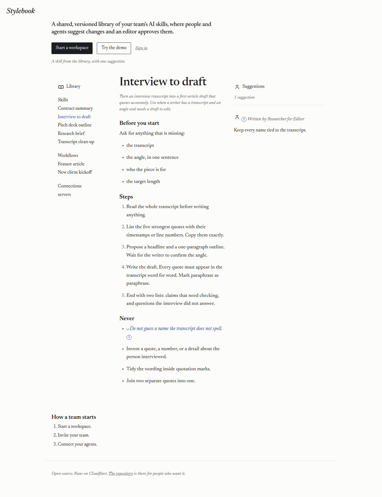
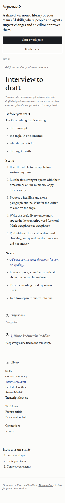
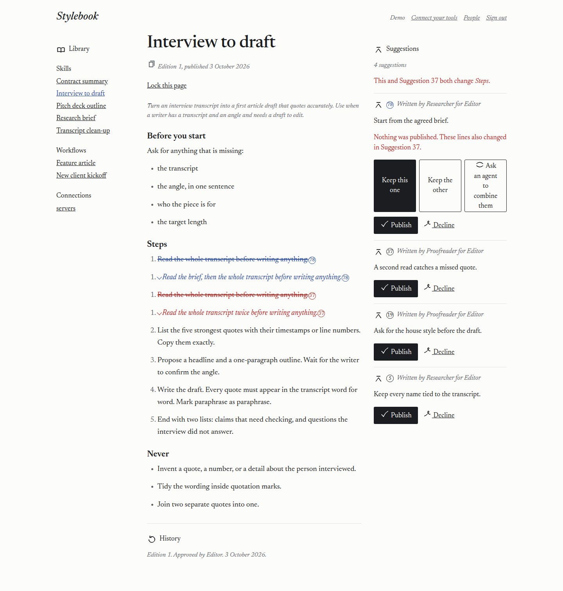
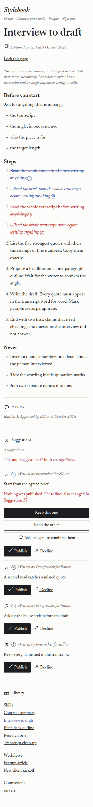
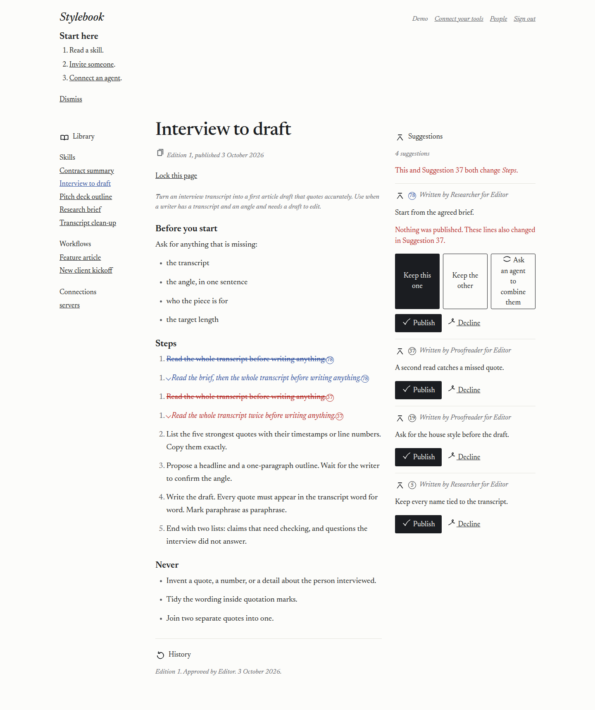
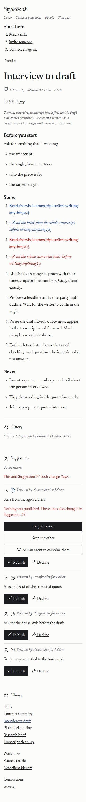
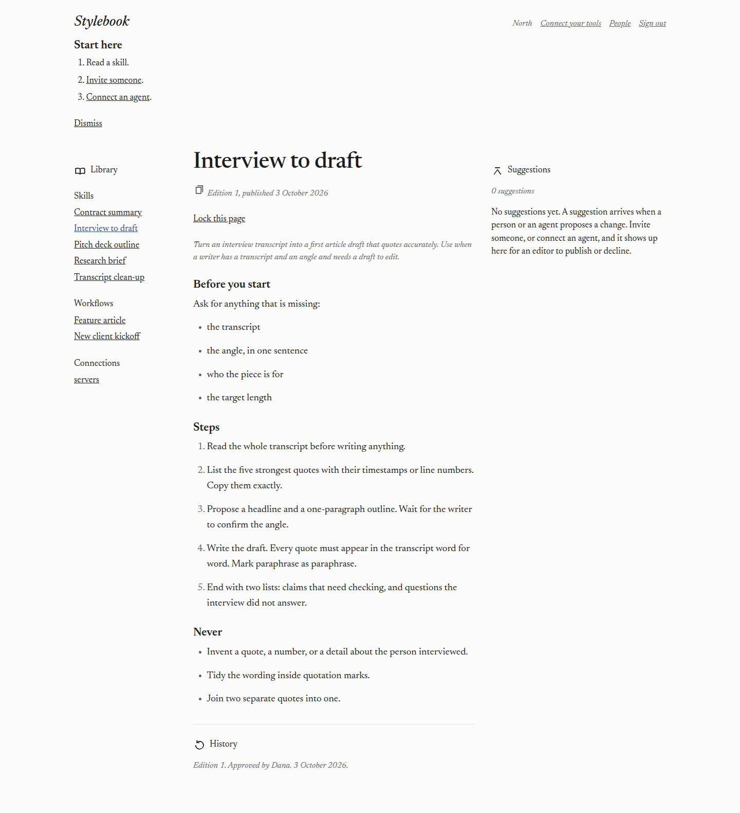
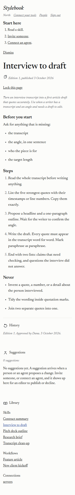
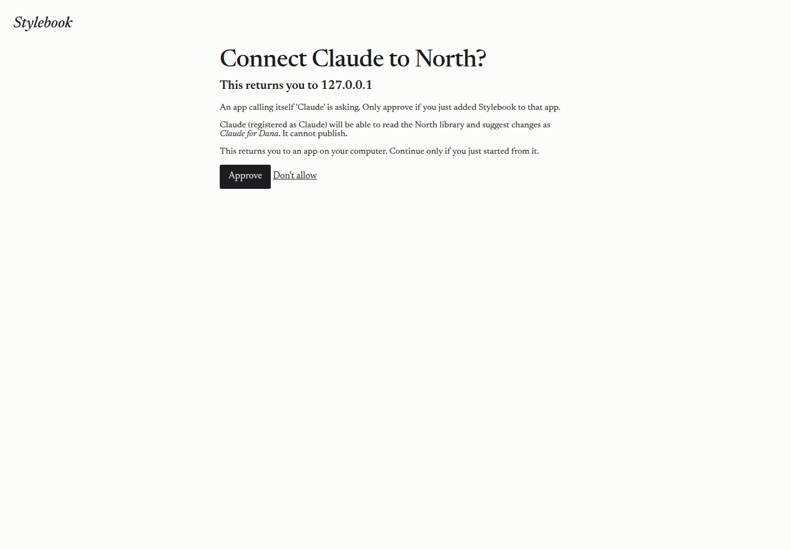
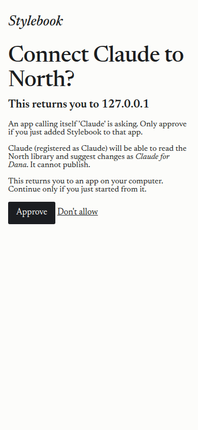

# 2026-10-03 — The front door

A Cursor cloud agent ran this against https://stylebook.dev.

- Date: 2026-10-03, about 10:01 UTC through 10:19 UTC.
- Worker name: `stylebook`. Version `6cc740f8-d93c-4c8f-894f-76c999199f78`. Wrangler 4.147.0.
- Code that was deployed: `9c3c13b3213640b85db4b07abb9133bde82440c9`. The deploy ran from that tree. This log and the pictures were added after.
- The demo secret was not changed. No address, account id, team host, or workers.dev hostname is recorded here.

## What was deployed

`npx wrangler d1 migrations apply stylebook --remote` applied `0011_demo_copies.sql` (the demo-copy table, and the welcome flag) and `0012_demo_paint.sql` (the first page saved for the visitor's next request). Both reported success.

`npx wrangler deploy` published the Worker. The deploy listed `schedule: 17 * * * *` and left the existing push trigger in place. Cron Triggers run in UTC. See [Cron Triggers](https://developers.cloudflare.com/workers/configuration/cron-triggers/) and the [scheduled handler](https://developers.cloudflare.com/workers/runtime-apis/handlers/scheduled/).

A copy is made with `fork()` in the same namespace, which is what records where it came from. See the [Workers binding](https://developers.cloudflare.com/artifacts/api/workers-binding/). The visitor's calls are counted in the same usage table. See [Artifacts pricing](https://developers.cloudflare.com/artifacts/platform/pricing/).

## The first page

Signed out, `GET /` returned 200. The page says what Stylebook is, shows the Interview to draft skill with one blue-pencil suggestion (Researcher, for Editor, "Keep every name tied to the transcript."), and offers Start a workspace, Try the demo, and a quiet Sign in link to `/enter`. The only "open source" and the only link to the repository are in the footer.

## Try the demo

`POST /try` with no email returned 303 to `/`, with a session cookie. Three visitors, one after another, once the shared Demo workspace was already there:

| Visit | Copy | Then the page | Together |
| --- | --- | --- | --- |
| 1 | 3809 ms | 140 ms | 3949 ms |
| 2 | 3150 ms | 59 ms | 3209 ms |
| 3 | 2844 ms | 66 ms | 2910 ms |

Each page was 200 and showed suggestions, Publish, and "Ask an agent to combine them." The three copies had different names. A copy's usage row recorded 12 forks plus gets and reads.

The other seeded suggestions are copied after the response. Five seconds later, Research brief on that copy showed 2 suggestions.

The daily cap is 80, in `MAX_DEMO_COPIES_PER_DAY`. It was not used up on the live host. The test sets the cap to the copies already made and the next try returns 429 with "The demo is full for today. Start a workspace, or come back tomorrow."

The same test publishes in one copy and checks that the shared Demo library and the other copy are unchanged. The live pages showed Publish, so the visitor is signed in as Editor, an Admin. The test checks that role directly.

## Deletion

One copy's expiry was set to `2000-01-01T00:00:00.000Z`. At 10:17:07 UTC the row was still there. At 10:17:55 UTC it was gone. That is the hourly job. The handler removes the repos and then the row, and it is awaited so a failure is retried.

## Welcome, empty list, consent

On one live copy the welcome flag was turned on. The page showed "Start here", with Read a skill, Invite someone, and Connect an agent, above the suggestions.

A brand-new workspace, with no suggestions yet, needs an email sign-in, and the consent page needs a tool to start the connection. Those two pictures are this commit's server, the same markup that was deployed. The new workspace shows "Start here" and "No suggestions yet. A suggestion arrives when a person or an agent proposes a change." The consent heading is "Connect Claude to North?" and the first line under it is "This returns you to 127.0.0.1".

## Accessibility

Lighthouse 12.8.2, mobile, accessibility only, on https://stylebook.dev/. Score **100**.

## Pictures

Wide is 1440 pixels. Phone is 390.

Landing, live:

Demo, live, with suggestions:

Welcome, live:

Empty list, this commit's server:

Consent, this commit's server:

