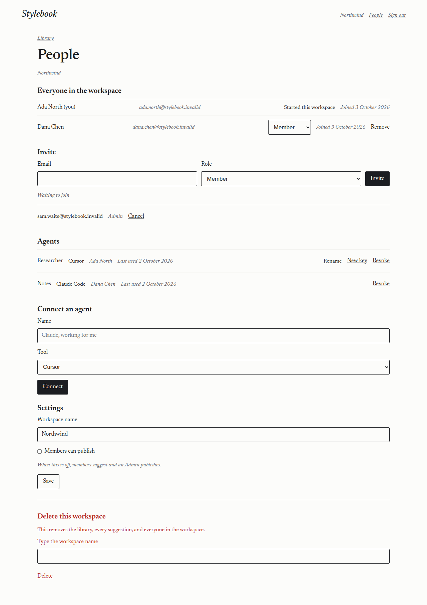
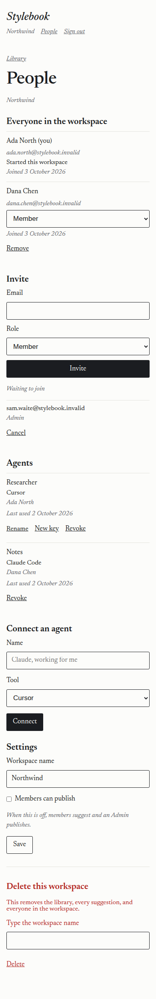
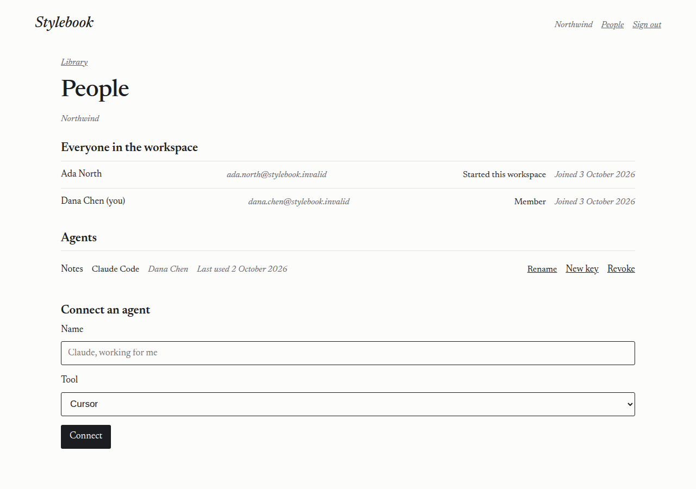
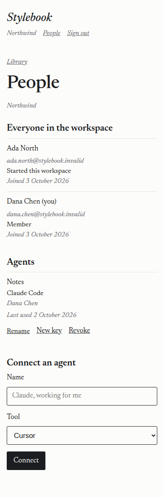

# 2026-10-03 — Suspension, admin page, second workspace, People

A Cursor cloud agent ran this against https://stylebook.dev.

- Date: 2026-10-03, about 02:50 UTC.
- Code that was deployed: `321db3be9ac77507b5df5158ba029b94f24db09b`.
- Worker name: `stylebook`. Version `8e1c208c-f9ac-40c4-a0f8-b82c35eac0e8`.
- Wrangler 4.147.0. The demo secret was not changed. Keys, addresses, the team host, and the workers.dev hostname are not recorded.

`wrangler d1 migrations apply stylebook --remote` applied `0008_admin_audit_actor.sql`. Wrangler reported 2 commands, success. That adds `actor_hash` to the service-admin audit. The address is stored only as a hash.

## What stayed public

Checked with user agent `stylebook-live-run`.

| Request | Status | What came back |
| --- | --- | --- |
| `GET /health` | 200 | `{"ok":true,"name":"stylebook"}` |
| `GET /` | 200 | The Stylebook sign-in page, with a link to `/enter`. It does not contain the library. |
| `GET /admin` with no identity | 404 | "That page is not available." No workspace name. |
| `POST /admin` with `Origin: https://evil.example` | 403 | "That request came from another site." |
| `POST /settings` with `Sec-Fetch-Site: cross-site` | 403 | "That request came from another site." |
| `GET /git/demo-library.git/info/refs?service=git-upload-pack` | 401 | "Missing or unknown key." |

## People

The pictures are this Worker's People page, wide (1280) and phone (390), with stand-in names. Signing in on the live site needs a mailbox, so these were captured from the page the Worker serves, the same markup that was deployed. No real address is in the pictures.

As an Admin the sections are everyone, then Invite, then Agents, then Settings. Delete is last, under a rule, in pencil-red, and says what it removes. Each person is one row: name and "(you)", email in graphite, role, joined date. The role is a select. The starter's row says "Started this workspace". Remove is a text button at the end of the row. Invite is email, role, and the Invite button on one line, with a waiting invitation and Cancel under it. Each agent is one row, and Rename opens inline. The "Members can publish" checkbox sits on the same line as its label.

As a Member the same rows are on the page, including "Started this workspace", without Invite, Cancel, the role select, Remove, the switch, or delete. Connect an agent is there, and the member's own agent has Rename, New key, and Revoke. At phone width each row stacks.

## Checks before the live run

`npm run typecheck` passed. `npm test` passed: 9 files, 83 tests. Those tests cover a suspended agent's refusal on a write to its own copy and on `/git/access` with write turned on, both cross-site checks, the audit hash, a member of one workspace joining a second and switching, and the admin page showing no workspace names.
